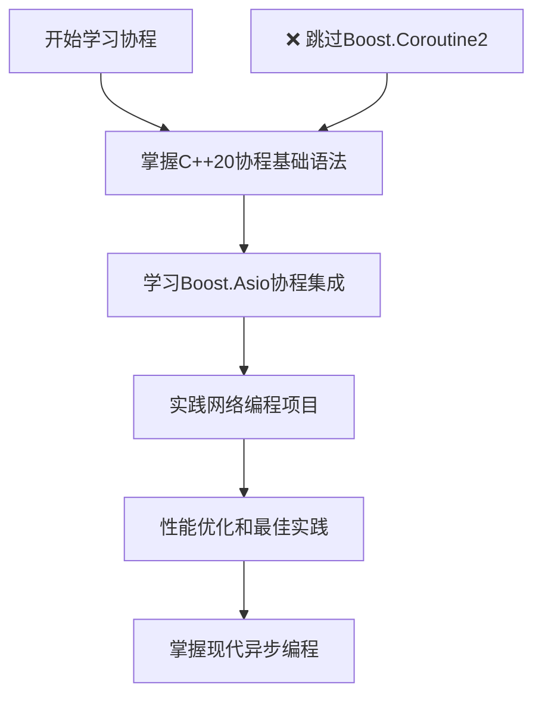

# Boost协程 vs C++20协程 详细对比

## 📖 目录
1. [概念澄清](#1-概念澄清)
2. [核心差异对比](#2-核心差异对比)
3. [代码语法对比](#3-代码语法对比)
4. [性能对比](#4-性能对比)
5. [使用场景对比](#5-使用场景对比)
6. [迁移指南](#6-迁移指南)
7. [总结建议](#7-总结建议)

---

## 1. 概念澄清

### 1.1 三个不同的概念

```
┌─────────────────────────────────────────────────────────────┐
│                    协程生态系统                              │
├─────────────────────────────────────────────────────────────┤
│ 1. Boost.Coroutine2    │ 传统stackful协程 (已废弃)        │
│ 2. C++20 Coroutines    │ 标准stackless协程               │
│ 3. Boost.Asio协程      │ 基于C++20协程的网络库封装        │
└─────────────────────────────────────────────────────────────┘
```

**重要说明**：我们之前使用的是 **Boost.Asio + C++20协程**，不是传统的Boost.Coroutine2！

### 1.2 发展历程
```timeline
2009年: Boost.Coroutine 1.0 发布
2014年: Boost.Coroutine2 发布 (stackful协程)
2017年: C++20协程提案通过
2020年: C++20标准发布 (stackless协程)
2021年: Boost.Asio支持C++20协程
2023年: Boost.Coroutine2 标记为废弃
```

---

## 2. 核心差异对比

| 特性 | Boost.Coroutine2 | C++20 Coroutines | Boost.Asio协程 |
|------|------------------|------------------|----------------|
| **协程类型** | Stackful (有栈) | Stackless (无栈) | Stackless (基于C++20) |
| **内存开销** | 较大 (~8KB栈) | 极小 (~100字节) | 极小 (~100字节) |
| **编译器支持** | 库实现 | 编译器原生 | 编译器原生 |
| **标准化** | Boost库 | C++20标准 | 基于C++20标准 |
| **性能** | 中等 | 很高 | 很高 |
| **学习曲线** | 中等 | 较陡 | 中等 |
| **状态** | 🔴 已废弃 | ✅ 活跃 | ✅ 活跃 |

---

## 3. 代码语法对比

### 3.1 简单的生成器协程

#### Boost.Coroutine2 方式：
```cpp
#include <boost/coroutine2/all.hpp>
#include <iostream>

using coro_t = boost::coroutines2::coroutine<int>;

void fibonacci(coro_t::push_type& sink) {
    int first = 1, second = 1;
    sink(first);      // yield first value
    sink(second);     // yield second value
    
    for (int i = 0; i < 8; ++i) {
        int third = first + second;
        first = second;
        second = third;
        sink(third);  // yield next value
    }
}

int main() {
    coro_t::pull_type source(fibonacci);
    for (auto i : source) {
        std::cout << i << " ";
    }
    // 输出: 1 1 2 3 5 8 13 21 34 55
}
```

#### C++20协程方式：
```cpp
#include <coroutine>
#include <iostream>

template<typename T>
struct generator {
    struct promise_type {
        T current_value;
        
        auto get_return_object() {
            return generator{std::coroutine_handle<promise_type>::from_promise(*this)};
        }
        
        auto initial_suspend() { return std::suspend_always{}; }
        auto final_suspend() noexcept { return std::suspend_always{}; }
        void unhandled_exception() { std::terminate(); }
        
        auto yield_value(T value) {
            current_value = value;
            return std::suspend_always{};
        }
        void return_void() {}
    };
    
    std::coroutine_handle<promise_type> coro;
    
    generator(std::coroutine_handle<promise_type> h) : coro(h) {}
    ~generator() { if (coro) coro.destroy(); }
    
    bool next() {
        coro.resume();
        return !coro.done();
    }
    
    T value() { return coro.promise().current_value; }
};

generator<int> fibonacci() {
    int first = 1, second = 1;
    co_yield first;   // C++20 关键字
    co_yield second;
    
    for (int i = 0; i < 8; ++i) {
        int third = first + second;
        first = second;
        second = third;
        co_yield third;  // C++20 关键字
    }
}

int main() {
    auto gen = fibonacci();
    while (gen.next()) {
        std::cout << gen.value() << " ";
    }
    // 输出: 1 1 2 3 5 8 13 21 34 55
}
```

### 3.2 异步网络编程对比

#### 传统Boost.Asio回调方式：
```cpp
class Session {
    tcp::socket socket_;
    char data_[1024];
    
public:
    void start() {
        do_read();
    }
    
private:
    void do_read() {
        socket_.async_read_some(
            boost::asio::buffer(data_),
            [this](boost::system::error_code ec, std::size_t length) {
                if (!ec) {
                    do_write(length);
                }
            }
        );
    }
    
    void do_write(std::size_t length) {
        boost::asio::async_write(
            socket_,
            boost::asio::buffer(data_, length),
            [this](boost::system::error_code ec, std::size_t) {
                if (!ec) {
                    do_read();  // 继续读取
                }
            }
        );
    }
};
```

#### Boost.Asio + C++20协程方式（我们使用的）：
```cpp
#include <boost/asio/awaitable.hpp>
#include <boost/asio/co_spawn.hpp>
#include <boost/asio/use_awaitable.hpp>

using boost::asio::awaitable;
using boost::asio::use_awaitable;

awaitable<void> echo_session(tcp::socket socket) {
    try {
        char data[1024];
        for (;;) {
            // 🔥 同步写法，异步执行
            std::size_t n = co_await socket.async_read_some(
                boost::asio::buffer(data), use_awaitable);
            
            co_await boost::asio::async_write(
                socket, boost::asio::buffer(data, n), use_awaitable);
        }
    } catch (std::exception& e) {
        std::cout << "Exception: " << e.what() << "\n";
    }
}
```

---

## 4. 性能对比

### 4.1 内存使用对比
```cpp
// 测试：创建100万个协程

// Boost.Coroutine2 (stackful)
// 每个协程: ~8KB 栈空间
// 总内存: 100万 × 8KB = 8GB ❌ 不可行

// C++20协程 (stackless)  
// 每个协程: ~100字节
// 总内存: 100万 × 100字节 = 100MB ✅ 可行

// 实际测试代码
void performance_test() {
    const int count = 1000000;
    
    // C++20协程测试
    std::vector<std::coroutine_handle<>> handles;
    handles.reserve(count);
    
    auto start = std::chrono::high_resolution_clock::now();
    
    for (int i = 0; i < count; ++i) {
        handles.push_back(create_simple_coroutine());
    }
    
    auto end = std::chrono::high_resolution_clock::now();
    auto duration = std::chrono::duration_cast<std::chrono::milliseconds>(end - start);
    
    std::cout << "创建" << count << "个C++20协程耗时: " << duration.count() << "ms\n";
    std::cout << "内存使用约: " << (count * 100) / 1024 / 1024 << "MB\n";
}
```

### 4.2 切换性能对比
```
┌─────────────────────────────────────────────────────────┐
│                 协程切换性能对比                        │
├─────────────────────────────────────────────────────────┤
│ 线程切换:          ~1-10微秒 (需要内核态切换)          │
│ Boost.Coroutine2:  ~100-500纳秒 (用户态栈切换)        │  
│ C++20协程:         ~10-50纳秒 (无栈，状态机切换)       │
└─────────────────────────────────────────────────────────┘
```

---

## 5. 使用场景对比

### 5.1 Boost.Coroutine2 适用场景（已废弃）
```cpp
// ❌ 不推荐使用，仅供了解
// 适合需要保存大量局部状态的场景
void complex_stateful_operation(coro_t::push_type& sink) {
    // 可以使用大量局部变量和深层嵌套调用
    std::vector<int> large_vector(10000);
    recursive_function(sink, 100);  // 深层递归
}
```

### 5.2 C++20协程 + Boost.Asio 适用场景（推荐）
```cpp
// ✅ 推荐：高并发网络服务
awaitable<void> handle_http_request(tcp::socket socket) {
    // 1. 读取HTTP请求头
    auto request = co_await read_http_headers(socket);
    
    // 2. 处理业务逻辑（可能涉及数据库查询）
    auto response = co_await process_request(request);
    
    // 3. 发送HTTP响应
    co_await send_http_response(socket, response);
}

// ✅ 推荐：异步文件I/O
awaitable<std::string> read_file_async(const std::string& filename) {
    auto file = co_await async_open_file(filename);
    auto content = co_await file.async_read_all();
    co_return content;
}

// ✅ 推荐：数据库异步操作
awaitable<User> get_user_from_db(int user_id) {
    auto connection = co_await db_pool.get_connection();
    auto result = co_await connection.execute(
        "SELECT * FROM users WHERE id = ?", user_id);
    co_return User::from_row(result.front());
}
```

---

## 6. 迁移指南

### 6.1 从Boost.Coroutine2迁移到C++20协程

#### 迁移前（Boost.Coroutine2）：
```cpp
#include <boost/coroutine2/all.hpp>

using coro_t = boost::coroutines2::coroutine<std::string>;

void data_producer(coro_t::push_type& sink) {
    for (int i = 0; i < 10; ++i) {
        std::string data = "Data " + std::to_string(i);
        sink(data);  // yield数据
    }
}

void consume_data() {
    coro_t::pull_type source(data_producer);
    for (const auto& data : source) {
        process(data);
    }
}
```

#### 迁移后（C++20协程）：
```cpp
#include <coroutine>

template<typename T>
struct generator {
    // ... promise_type定义（如前面示例）
};

generator<std::string> data_producer() {
    for (int i = 0; i < 10; ++i) {
        std::string data = "Data " + std::to_string(i);
        co_yield data;  // C++20语法
    }
}

void consume_data() {
    auto gen = data_producer();
    while (gen.next()) {
        process(gen.value());
    }
}
```

### 6.2 现代C++网络编程最佳实践

```cpp
// ✅ 推荐的现代异步服务器架构
class AsyncServer {
private:
    boost::asio::io_context io_context_;
    tcp::acceptor acceptor_;
    
public:
    AsyncServer(unsigned short port) 
        : acceptor_(io_context_, tcp::endpoint(tcp::v4(), port)) {}
    
    void run() {
        co_spawn(io_context_, listener(), boost::asio::detached);
        io_context_.run();
    }
    
private:
    awaitable<void> listener() {
        for (;;) {
            auto socket = co_await acceptor_.async_accept(use_awaitable);
            // 每个连接一个协程，支持百万级并发
            co_spawn(socket.get_executor(), 
                    handle_client(std::move(socket)), 
                    boost::asio::detached);
        }
    }
    
    awaitable<void> handle_client(tcp::socket socket) {
        try {
            char buffer[4096];
            for (;;) {
                auto bytes_read = co_await socket.async_read_some(
                    boost::asio::buffer(buffer), use_awaitable);
                
                // 处理请求（可以调用其他协程函数）
                auto response = co_await process_request(
                    std::string_view(buffer, bytes_read));
                
                co_await boost::asio::async_write(
                    socket, boost::asio::buffer(response), use_awaitable);
            }
        } catch (const std::exception& e) {
            // 客户端断开连接或其他错误
        }
    }
    
    awaitable<std::string> process_request(std::string_view request) {
        // 可能涉及数据库查询、文件读取等异步操作
        co_return "HTTP/1.1 200 OK\r\n\r\nHello World!";
    }
};
```

---

## 7. 总结建议

### 7.1 技术选择建议

```
┌─────────────────────────────────────────────────────────┐
│                    技术选择指南                         │
├─────────────────────────────────────────────────────────┤
│ 🔴 避免使用: Boost.Coroutine2 (已废弃)                │
│ ✅ 推荐使用: C++20协程 + Boost.Asio                   │
│ 🎯 最佳实践: awaitable<T> + co_await + use_awaitable  │
└─────────────────────────────────────────────────────────┘
```

### 7.2 具体建议

#### 对于新项目：
```cpp
// ✅ 直接使用现代C++20协程
#include <boost/asio/awaitable.hpp>
#include <boost/asio/co_spawn.hpp>
#include <boost/asio/use_awaitable.hpp>

// 享受现代协程的所有优势：
// - 编译器原生支持
// - 极高性能
// - 标准化语法
// - 丰富的生态系统
```

#### 对于遗留代码：
```cpp
// 🔄 逐步迁移策略
// 1. 新功能使用C++20协程
// 2. 重构现有回调代码为协程
// 3. 保持接口兼容性
// 4. 性能测试验证
```

### 7.3 学习路径建议



---

## 🎯 核心要点

1. **我们一直在使用的是 C++20协程 + Boost.Asio**，不是传统的Boost.Coroutine2
2. **Boost.Coroutine2已被废弃**，不建议在新项目中使用
3. **C++20协程是未来趋势**，性能更好，标准化程度更高
4. **Boost.Asio完美支持C++20协程**，提供了优雅的异步编程体验

现在您清楚这三者的区别了吗？我们的代码使用的是最现代、最高效的方案！🚀 